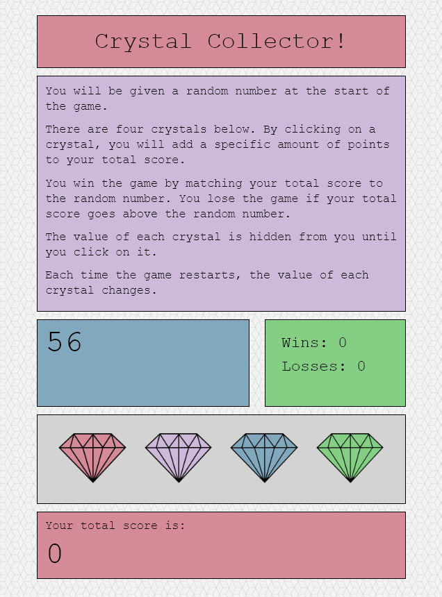

# unit-4-game

This version of the Crystal(s) Collector game was created by Alex Bowen (github.com/alex-bowen). This project uses jQuery and JavaScript to create a game similar to _blackjack_. 

Here's how the game works: 

  ### 1) The player is given a *random number* (randomGoal) at the start of the game.
       
         var randomGoal;

          function getRandomInt(min, max) {
          min = Math.ceil(min);
          max = Math.floor(max);
          return Math.floor(Math.random() * (max - min)) + min;
          }

          randomGoal = getRandomInt(19, 120);
          $("#goalNumber").text(randomGoal);

  ### 2) There are four crystals on the page. By *clicking* on a crystal, the player *adds a specific, hidden amount of points to the total score variable* (totalScore).
  
          // getRandomInt function generates random numbers, and we assign them to each crystal.
          crystalValue1 = getRandomInt(1, 12);
          crystalValue2 = getRandomInt(1, 12);
          crystalValue3 = getRandomInt(1, 12);
          crystalValue4 = getRandomInt(1, 12);

          // Adds value of crystals to a totalScore variable when clicked, 
          $("#gem1").click(function () {
              $("#total-score").html(totalScore + crystalValue1);
              // Adds value of clicked gem to total score
              totalScore = totalScore + crystalValue1;
              tally();
          })

          $("#gem2").click(function () {
              $("#total-score").html(totalScore + crystalValue2);
              totalScore = totalScore + crystalValue2;
              tally();

          })

          $("#gem3").click(function () {
              $("#total-score").html(totalScore + crystalValue3);
              totalScore = totalScore + crystalValue3;
              tally();

          })

          $("#gem4").click(function () {
              $("#total-score").html(totalScore + crystalValue4);
              totalScore = totalScore + crystalValue4;
              tally();

          })

  ### 3) The player wins game by *matching* the total score (totalScore) to the random number (randomGoal). The player loses if the total score is *greater than* the random number.
  
         // Keeps track of wins and losses
          function tally() {
              if (totalScore === randomGoal) {
                  wins++;
                  // change html
                  $("#wins-tally").text("Wins: " + wins);
                  $("#exclamation").html("You win!");

                  resetGame();

              } else if (totalScore > randomGoal) {
                  losses++;
                  // change html
                  $("#losses-tally").text("Losses: " + losses);
                  $("#exclamation").text("You lose!");

                  resetGame();

              }
          }

  ### 4) Each time the game restarts, a new random number (randomGoal) is generated, and the value of each crystal is changed.
  
          // reset function -- resets stats and generates random numbers all around
            function resetGame() {
                totalScore = 0;
                $("#total-score").html(totalScore);
                randomGoal = getRandomInt(19, 120);
                $("#goalNumber").text(randomGoal);
                crystalValue1 = getRandomInt(1, 12);
                crystalValue2 = getRandomInt(1, 12);
                crystalValue3 = getRandomInt(1, 12);
                crystalValue4 = getRandomInt(1, 12);
            }
  
  
  You may email me with any questions at alexbowen2017@gmail.com! 
